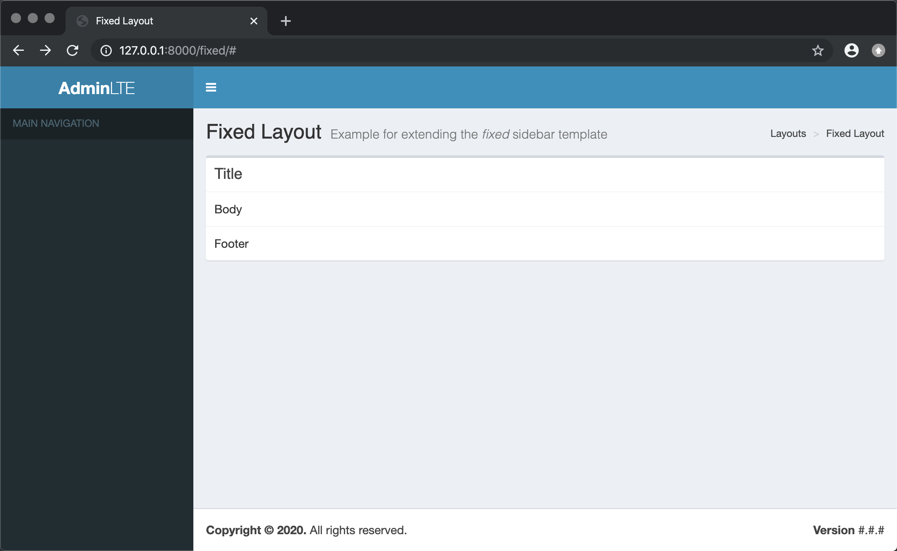
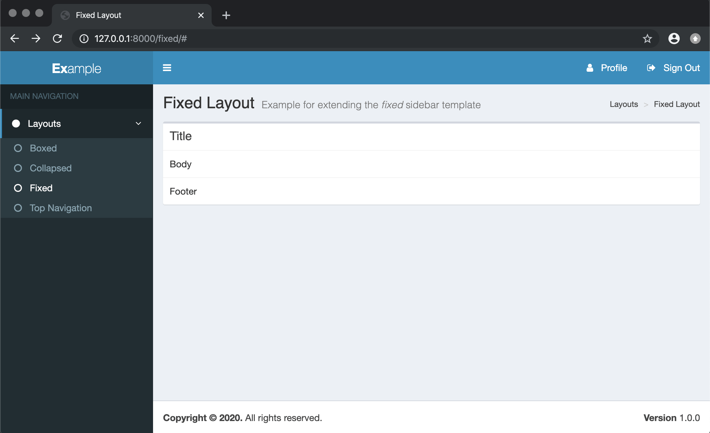
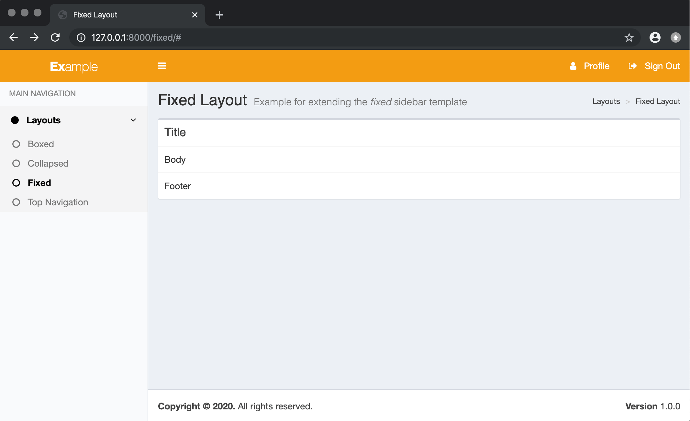

Quickstart
==========

.. warning::

    This quickstart assumes you already have **django-adminlte2-templates** installed.
    If you do not, please check the `Installation <installation.html>`_ section for more details.

Using a layout template
^^^^^^^^^^^^^^^^^^^^^^^

.. note::

    For more information on the available layout and component templates, please check the `Layouts and Components <layouts_and_components.html>`_ section.
    You may also check the `Template Blocks <template_blocks.html>`_ section for more details on the available block tags to use.

In this example, we will extend the *fixed* sidebar template (``adminlte2/layouts/fixed.html``).

Extending ``adminlte2/layouts/fixed.html``:

.. code:: jinja

    

    Fixed Layout

    Fixed Layout

    Example for extending the <i>fixed</i> sidebar template

    
        <li><a href="">Layouts</a></li>
        <li><a href="">Fixed</a></li>
    

    
        

            

                <h3 class="box-title">Title</h3>
            

            

                Body
            

            

                Footer
            

        

    

Using the extended template will generate:

You can also override the sidebar (``adminlte2/components/sidebar.html``), header (``adminlte2/components/header.html``),
and footer (``adminlte2/components/footer.html``) component templates to update their content:

Overriding ``adminlte2/components/sidebar.html``:

.. code:: jinja

    

    
        <li class="treeview active">
            <a href="#">
                <i class="fa fa-circle"></i> Layouts
                
                  <i class="fa fa-angle-left pull-right"></i>
                
            </a>
            <ul class="treeview-menu">
                <li><a href=""><i class="fa fa-circle-o"></i> Boxed</a></li>
                <li><a href=""><i class="fa fa-circle-o"></i> Collapsed</a></li>
                <li class="active"><a href=""><i class="fa fa-circle-o"></i> Fixed</a></li>
                <li><a href=""><i class="fa fa-circle-o"></i> Top Navigation</a></li>
            </ul>
        </li>
    

Overriding ``adminlte2/components/header.html``:

.. code:: jinja

    

    
        <b>Ex</b>ample
    

    
        <b>Ex</b>
    

    
        <li><a href="#"><i class="fa fa-user"></i>&nbsp;&nbsp; Profile</a></li>
        <li><a href="#"><i class="fa fa-sign-out"></i>&nbsp;&nbsp; Sign Out</a></li>
    

Overriding ``adminlte2/components/footer.html``:

.. code:: jinja

    

    
        1.0.0
    

Overriding the aforementioned component templates will generate:

Setting ``settings.py`` variables
^^^^^^^^^^^^^^^^^^^^^^^^^^^^^^^^^

.. note::

    For more information on the available ``settings.py`` variables that you can use, please check the `Settings <settings.html>`_ section.

You can change the AdminLTE 2 skin theme by adding ``ADMINLTE_SKIN_THEME`` to ``settings.py``:

.. code:: python

    #
    # Valid values are: 'skin-black', 'skin-black-light', 'skin-blue', 'skin-blue-light',
    # 'skin-green', 'skin-green-light', 'skin-purple', 'skin-purple-light',
    # 'skin-red', 'skin-red-light', 'skin-yellow', 'skin-yellow-light'.
    #
    # Defaults to 'skin-blue'.
    #
    ADMINLTE_SKIN_THEME = 'skin-orange-light'

Updating the page will generate:

Using template tags
^^^^^^^^^^^^^^^^^^^

.. note::

    For more information on the available template tags that you can use, please check the `Template Tags <template_tags.html>`_ section.

You can use the ```` template tag to automate setting the sidebar links of the current page as active.

For example, updating the sidebar ``adminlte2/components/sidebar.html`` component template:

.. code:: jinja

    

    
        <li class="treeview ">
            <a href="#">
                <i class="fa fa-circle"></i> Layouts
                
                  <i class="fa fa-angle-left pull-right"></i>
                
            </a>
            <ul class="treeview-menu">
                <li class=""><a href=""><i class="fa fa-circle-o"></i> Boxed</a></li>
                <li class=""><a href=""><i class="fa fa-circle-o"></i> Collapsed</a></li>
                <li class=""><a href=""><i class="fa fa-circle-o"></i> Fixed</a></li>
                <li class=""><a href=""><i class="fa fa-circle-o"></i> Top Navigation</a></li>
            </ul>
        </li>
    
